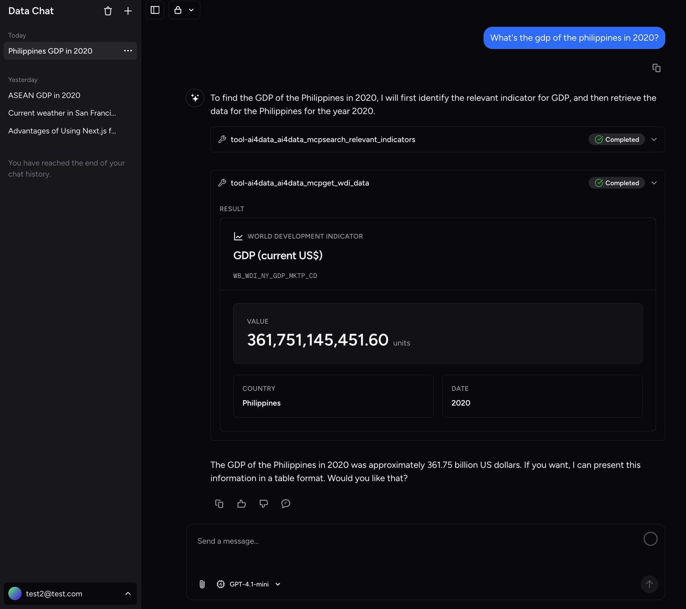

<div align="center">

  <h1>Data AI Chatbot</h1>
  <p>
    <strong>An AI assistant for World Bank development data — conversations, analysis, charts, and documents powered by MCP and Proof-Carrying Numbers</strong>
  </p>
  <p>
    <a href="#features">Features</a> ·
    <a href="#architecture">Architecture</a> ·
    <a href="#getting-started">Getting Started</a> ·
    <a href="#configuration">Configuration</a> ·
    <a href="#authentication">Authentication</a> ·
    <a href="#deployment">Deployment</a> ·
    <a href="DEVELOPER.md">Developer Guide</a> ·
    <a href="https://worldbank.github.io/data-ai-chatbot">Documentation</a>
  </p>
  
</div>

---

## What is this?

**Data AI Chatbot** (internally _Data360 Chat_) is a full-stack AI chatbot application built by the World Bank's AI for Data team, forked from the [Vercel AI Chatbot](https://github.com/vercel/ai-chatbot). It connects to the [Data360 MCP Server](https://github.com/worldbank/data360-mcp) to give users natural-language access to World Bank development indicators, with real-time data retrieval, chart generation, and Proof-Carrying Numbers (PCN) verification that lets users see exactly which numeric claims are grounded in source data.

The application serves as the **reference implementation for MCP + PCN integration** in a production chatbot, and is designed to be self-hostable by other institutions building data-oriented AI applications.

**Intended audience:**

- World Bank staff and partners querying development data through natural language
- Developers building data-oriented AI chatbots who want a production-grade reference
- Teams evaluating MCP + PCN patterns for trustworthy AI data presentation

---

## Features

### Data Access via MCP (Model Context Protocol)

The backend connects to any [MCP](https://modelcontextprotocol.io/) server over HTTP/SSE. Out of the box it ships pre-configured for the **Data360 MCP Server**, which exposes tools to:

- Search World Bank development indicators by keyword or topic
- Retrieve time-series data for any country and indicator
- Fetch indicator metadata, disaggregations, and codelists
- Generate Vega-Lite chart specifications from data
- Access a curated `data360://system-prompt` resource that shapes AI reasoning

Any other MCP server can be plugged in by changing `MCP_SERVER_URL`.

### Proof-Carrying Numbers (PCN)

Numbers in AI responses are a known reliability problem. This app integrates **[Proof-Carrying Numbers](https://github.com/worldbank/pcn-js)** (`@pcn-js/core`, `@pcn-js/ui`, `@pcn-js/data360`), which annotates numeric values in the chat output with verification badges. Each badge shows whether the number was:

- Verified against a tool result (with source link)
- Unverified (model-generated without a data source)

This makes it clear at a glance which statistics can be trusted.

### Multi-model AI

All AI inference is routed through [LiteLLM](https://litellm.vercel.app/), which abstracts over providers. Supported out of the box:

| Provider                        | Notes                                                                                 |
| ------------------------------- | ------------------------------------------------------------------------------------- |
| Azure OpenAI                    | Recommended for enterprise deployments; supports API key or OAuth2 client credentials |
| OpenAI                          | Standard API key                                                                      |
| Anthropic                       | Claude models                                                                         |
| Google                          | Gemini models                                                                         |
| Any LiteLLM-compatible provider | See [LiteLLM docs](https://docs.litellm.ai/docs/providers)                            |

Individual model roles are independently configurable: `CHAT_MODEL`, `CHAT_MODEL_REASONING`, `TITLE_MODEL`, `ARTIFACT_MODEL`.

### Artifact Panel

The chat interface includes a live side-panel for rendering AI-generated artifacts:

- **Code** — syntax-highlighted, editable with CodeMirror
- **Documents** — rich text with ProseMirror / Markdown rendering
- **Spreadsheets** — tabular data with react-data-grid
- **Charts** — interactive Vega / Vega-Lite visualizations

### Rich Chat Interface

- Streaming responses with resumable-stream support (survives page refresh)
- Chat history with per-message voting and feedback
- File attachments (images; configurable size/type limits)
- Math equations (KaTeX), GitHub Flavored Markdown, code syntax highlighting (Shiki)
- Token usage display
- Extended-thinking / reasoning step display (collapsible)
- Maintenance mode page

---

## Architecture

The application is a **monorepo** with two independently deployable services:

```
data-ai-chatbot/
├── frontend/          # Next.js 16 (App Router) — TypeScript, React 19, Tailwind CSS
└── backend/           # FastAPI — Python 3.11+, SQLAlchemy, PostgreSQL, Redis
```

### System diagram

```
 Browser
    │  HTTPS
    ▼
┌──────────────────────┐
│  Next.js Frontend    │  Port 3001
│  (App Router + RSC)  │
│  - Chat UI           │
│  - Artifact panel    │
│  - Auth (MSAL/guest) │
└────────┬─────────────┘
         │  REST + SSE streaming
         ▼
┌──────────────────────┐
│  FastAPI Backend     │  Port 8001
│  - /api/v1/chat      │
│  - Auth (JWT/MSAL)   │
│  - LiteLLM routing   │
│  - MCP client        │
└──┬──────────┬────────┘
   │          │
   ▼          ▼
PostgreSQL   Redis (optional)
(chat/users) (resumable streams)
             │
             ▼ MCP over HTTP/SSE
       ┌─────────────────┐
       │  Data360 MCP    │  (or any MCP server)
       │  Server         │
       └─────────────────┘
              │
              ▼
        World Bank Data360 API
```

### Frontend tech stack

| Technology              | Role                       |
| ----------------------- | -------------------------- |
| Next.js 16 (App Router) | Framework, SSR, API routes |
| React 19                | UI                         |
| TypeScript              | Type safety                |
| Tailwind CSS v4         | Styling                    |
| shadcn/ui + Radix UI    | Component library          |
| Vercel AI SDK           | Streaming chat protocol    |
| Vega / Vega-Lite        | Chart rendering            |
| CodeMirror 6            | Code editing               |
| ProseMirror             | Rich text editing          |
| `@pcn-js/*`             | Proof-Carrying Numbers     |
| `@azure/msal-browser`   | Azure AD authentication    |

### Backend tech stack

| Technology                | Role                                  |
| ------------------------- | ------------------------------------- |
| FastAPI                   | API framework                         |
| Python 3.11+              | Language                              |
| SQLAlchemy (async)        | ORM                                   |
| PostgreSQL                | Primary database                      |
| Alembic                   | Database migrations                   |
| Redis                     | Optional resumable streams / caching  |
| LiteLLM                   | Multi-provider LLM abstraction        |
| FastMCP                   | MCP client/server framework           |
| `azure-identity` / `msal` | Azure AD token handling               |
| `uv`                      | Dependency and virtual-env management |

---

## Getting Started

### Option A — Docker (recommended for first run)

The fastest way to get everything running locally.

**Prerequisites:** [Docker Desktop](https://www.docker.com/products/docker-desktop/) (4 GB RAM minimum).

```bash
# 1. Clone the repo
git clone https://github.com/worldbank/data-ai-chatbot.git
cd data-ai-chatbot

# 2. Create backend env file from the example
cp backend/.env.example backend/.env
# Open backend/.env and fill in at minimum:
#   AZURE_API_KEY / AZURE_API_BASE  (or another LLM provider)
#   JWT_SECRET_KEY  (generate with: openssl rand -base64 32)

# 3. Create a root .env for Docker Compose variable substitution
cat > .env <<'EOF'
POSTGRES_USER=user
POSTGRES_PASSWORD=changeme
POSTGRES_DB=chatbot_db
EOF

# 4. Create frontend env file
cp frontend/environments/.env.example frontend/.env.local
# Set NEXT_PUBLIC_API_URL=http://localhost:8001 (already the default)

# 5. Start all services (frontend, backend, PostgreSQL, Redis)
docker compose up -d --build
```

Services after startup:

| Service     | URL                        |
| ----------- | -------------------------- |
| Frontend    | http://localhost:3001      |
| Backend API | http://localhost:8001      |
| Swagger UI  | http://localhost:8001/docs |

See [docs/docker-setup.md](docs/docker-setup.md) for detailed Docker instructions, troubleshooting, and production considerations.

---

### Option B — Manual local setup

**Prerequisites:**

| Tool       | Version  | Install                                            |
| ---------- | -------- | -------------------------------------------------- |
| Node.js    | 18+      | [nodejs.org](https://nodejs.org)                   |
| pnpm       | 9.12.3+  | `npm install -g pnpm`                              |
| Python     | 3.11+    | [python.org](https://python.org)                   |
| uv         | latest   | `curl -LsSf https://astral.sh/uv/install.sh \| sh` |
| PostgreSQL | 14+      | [postgresql.org](https://postgresql.org)           |
| Redis      | optional | [redis.io](https://redis.io)                       |

#### 1. Clone and set up environment files

```bash
git clone https://github.com/worldbank/data-ai-chatbot.git
cd data-ai-chatbot

# Backend
cp backend/.env.example backend/.env
# Edit backend/.env — fill in database credentials, LLM API keys, JWT_SECRET_KEY

# Frontend
cp frontend/environments/.env.example frontend/.env.local
# Edit frontend/.env.local — set NEXT_PUBLIC_API_URL and other vars
```

#### 2. Set up the database

```bash
# Create a PostgreSQL database
createdb chatbot_db

# Run migrations
cd backend
uv run alembic upgrade head
cd ..
```

#### 3. Start the backend

```bash
cd backend
uv sync                                              # Install dependencies
uv run uvicorn app.main:app --reload --port 8001     # Start with hot-reload
```

The API will be available at http://localhost:8001 — Swagger UI at http://localhost:8001/docs.

#### 4. Start the frontend

```bash
cd frontend
pnpm install       # Install dependencies
pnpm dev           # Start dev server (http://localhost:3001)
```

---

## Configuration

### Backend (`backend/.env`)

| Variable                          | Required | Description                                                         |
| --------------------------------- | -------- | ------------------------------------------------------------------- |
| `POSTGRES_HOST`                   | Yes      | PostgreSQL host (default: `localhost`)                              |
| `POSTGRES_PORT`                   | Yes      | PostgreSQL port (default: `5432`)                                   |
| `POSTGRES_USER`                   | Yes      | Database user                                                       |
| `POSTGRES_PASSWORD`               | Yes      | Database password                                                   |
| `POSTGRES_DB`                     | Yes      | Database name                                                       |
| `JWT_SECRET_KEY`                  | Yes      | Secret for signing JWTs — generate with `openssl rand -base64 32`   |
| `JWT_ACCESS_TOKEN_EXPIRE_MINUTES` | No       | Token lifetime (default: `30`)                                      |
| `AZURE_API_KEY`                   | Yes\*    | Azure OpenAI API key (\*or use client credentials below)            |
| `AZURE_API_BASE`                  | Yes\*    | Azure OpenAI endpoint URL                                           |
| `AZURE_API_VERSION`               | No       | API version (default: `2024-02-15-preview`)                         |
| `AZURE_CLIENT_ID`                 | No       | OAuth2 client ID (alternative to API key)                           |
| `AZURE_CLIENT_SECRET`             | No       | OAuth2 client secret                                                |
| `AZURE_TENANT_ID`                 | No       | Azure AD tenant ID                                                  |
| `MODEL_PROVIDER`                  | No       | LiteLLM model prefix (default: `azure/`)                            |
| `CHAT_MODEL`                      | No       | Model for chat (default: `gpt-4o-mini`)                             |
| `CHAT_MODEL_REASONING`            | No       | Model for reasoning/thinking                                        |
| `TITLE_MODEL`                     | No       | Model for generating chat titles                                    |
| `ARTIFACT_MODEL`                  | No       | Model for generating artifacts                                      |
| `MCP_SERVER_URL`                  | No       | MCP server URL (default: Data360 public endpoint)                   |
| `MCP_SSL_VERIFY`                  | No       | SSL verification for MCP (`true`/`false`)                           |
| `REDIS_URL`                       | No       | Redis URL for resumable streams (e.g. `redis://localhost:6379`)     |
| `CORS_ORIGINS`                    | No       | Comma-separated allowed origins                                     |
| `ENVIRONMENT`                     | No       | `development` / `production`                                        |
| `AUTH_PROVIDER`                   | No       | `guest` \| `user` \| `msal` (see [Authentication](#authentication)) |
| `RATE_LIMIT_ENABLED`              | No       | Enable per-user/IP rate limiting                                    |
| `LOG_FILE`                        | No       | Log output file path                                                |

Full reference with all optional variables: [`backend/.env.example`](backend/.env.example)

### Frontend (`frontend/.env.local`)

| Variable                            | Required | Description                                                                     |
| ----------------------------------- | -------- | ------------------------------------------------------------------------------- |
| `NEXT_PUBLIC_APP_ENV`               | Yes      | Deployment environment: `dev` \| `qa` \| `uat` \| `prod`                        |
| `NEXT_PUBLIC_API_URL`               | Yes      | Backend API URL (e.g. `http://localhost:8001`)                                  |
| `NEXT_PUBLIC_BASE_URL`              | Yes      | Frontend public URL                                                             |
| `INTERNAL_API_SECRET`               | Yes      | Shared secret for backend → frontend internal calls                             |
| `SERVER_API_URL`                    | No       | Server-side API URL (overrides `NEXT_PUBLIC_API_URL` for SSR; needed in Docker) |
| `NEXT_PUBLIC_AUTH_PROVIDER`         | No       | `guest` \| `user` \| `msal` \| `data360`                                        |
| `NEXT_PUBLIC_MSAL_CLIENT_ID`        | No       | Azure AD app client ID (MSAL mode)                                              |
| `NEXT_PUBLIC_MSAL_AUTHORITY`        | No       | Azure AD authority URL                                                          |
| `NEXT_PUBLIC_DATA360_AUTH_URL`      | No       | Data360 re-auth redirect URL (data360 mode)                                     |
| `MAINTENANCE_MODE`                  | No       | Show maintenance page (`true`/`false`)                                          |
| `NEXT_PUBLIC_VEGA_CUSTOM_THEME_URL` | No       | URL to custom Vega theme JSON                                                   |
| `NEXT_PUBLIC_APPLICATION_STATUS`    | No       | Banner: `pre-alpha` \| `alpha` \| `beta`                                        |

Full reference: [`frontend/docs/env-variables.md`](frontend/docs/env-variables.md)

---

## Authentication

The application supports four authentication modes, set via `AUTH_PROVIDER` (backend) and `NEXT_PUBLIC_AUTH_PROVIDER` (frontend):

| Mode      | Description                                                                                                                                                           | Best for                                |
| --------- | --------------------------------------------------------------------------------------------------------------------------------------------------------------------- | --------------------------------------- |
| `guest`   | Anyone can use the app without logging in. All users share a single guest session.                                                                                    | Public demos, quick evaluation          |
| `user`    | Email + password login with optional guest access. Users are created via the admin API or self-registration.                                                          | Internal tools with user accounts       |
| `msal`    | Azure AD authentication via MSAL. Users log in with their corporate identity.                                                                                         | Enterprise/World Bank staff deployments |
| `data360` | Embedded mode for Data360 portal. Parent app sets a signed `searchToken` cookie before redirecting; the chatbot validates it without requiring a separate login flow. | Embedded integration in Data360         |

### Setting up MSAL authentication

1. Register an app in Azure AD with redirect URI pointing to `<your-frontend-url>/login`
2. Set `NEXT_PUBLIC_AUTH_PROVIDER=msal` (frontend) and `AUTH_PROVIDER=msal` (backend)
3. Set `NEXT_PUBLIC_MSAL_CLIENT_ID`, `NEXT_PUBLIC_MSAL_AUTHORITY` (frontend)
4. Set `AZURE_AD_TENANT_ID`, `AZURE_AD_CLIENT_ID` (backend)

See [`frontend/docs/env-variables.md`](frontend/docs/env-variables.md) for the full Azure AD variable reference.

---

## Deployment

### Docker Compose (development / testing)

See [docs/docker-setup.md](docs/docker-setup.md).

### Docker Compose (production)

A `docker-compose.prod.yml` is provided for production-like deployments. Key differences from dev:

- No hot-reload
- Production-optimized Next.js build
- Proper environment variable handling

```bash
docker compose -f docker-compose.prod.yml up -d --build
```

### Deploying to Azure App Service

The application can be deployed to Azure App Service using the provided Dockerfiles. Refer to [`docs/deployment/`](site/deployment/) in the documentation site for step-by-step instructions.

---

## Project Structure

```
data-ai-chatbot/
├── frontend/                   # Next.js 16 application
│   ├── app/
│   │   ├── (auth)/             # Login, register, guest pages
│   │   ├── (chat)/             # Chat interface and layout
│   │   └── api/                # Next.js API routes (proxy to backend)
│   ├── components/             # React components
│   │   ├── chat.tsx            # Main chat component
│   │   ├── artifact.tsx        # Artifact side-panel
│   │   └── ...
│   ├── lib/
│   │   ├── ai/                 # AI SDK configuration
│   │   └── server-api-client.ts # Backend HTTP client
│   ├── hooks/                  # React hooks
│   ├── environments/           # Per-environment .env files
│   └── docs/                   # Frontend-specific documentation
│
├── backend/                    # FastAPI application
│   ├── app/
│   │   ├── api/v1/             # API endpoints
│   │   │   ├── chat.py         # Chat endpoints
│   │   │   ├── chat_stream.py  # Streaming endpoint
│   │   │   ├── auth.py         # Authentication endpoints
│   │   │   └── ...
│   │   ├── ai/                 # LiteLLM + MCP client
│   │   │   ├── client.py       # LiteLLM wrapper
│   │   │   ├── mcp_client.py   # MCP tool invocation
│   │   │   └── prompts.py      # System prompts
│   │   ├── core/               # App config (pydantic-settings)
│   │   ├── db/                 # Database queries
│   │   ├── models/             # SQLAlchemy models
│   │   └── utils/              # Utilities
│   ├── alembic/                # Database migration scripts
│   └── tests/                  # Pytest test suite
│
├── docs/                       # Markdown documentation source
├── site/                       # Built documentation site (GitHub Pages)
├── docker-compose.yml          # Dev Docker Compose
├── docker-compose.prod.yml     # Production Docker Compose
├── DEVELOPER.md                # Developer guide
├── CONTRIBUTING.md             # Contribution guidelines
├── CODE_OF_CONDUCT.md          # Code of conduct
├── CITATION.cff                # Citation metadata
├── THIRD_PARTY_LICENSES.md     # Third-party license inventory
└── WB-IGO-RIDER.md             # World Bank IGO license rider
```

---

## Development

### Running tests

**Frontend (Playwright E2E):**

```bash
cd frontend
pnpm test
```

**Backend (pytest):**

```bash
cd backend
uv run pytest tests/
```

### Code style

| Component | Formatter / Linter                   | Command                                        |
| --------- | ------------------------------------ | ---------------------------------------------- |
| Frontend  | [Biome](https://biomejs.dev/)        | `pnpm lint` / `pnpm format`                    |
| Backend   | [Ruff](https://docs.astral.sh/ruff/) | `uv run ruff check .` / `uv run ruff format .` |

### Database migrations

```bash
cd backend

# Apply all pending migrations
uv run alembic upgrade head

# Create a new migration (after changing SQLAlchemy models)
uv run alembic revision --autogenerate -m "add my new table"

# Roll back one migration
uv run alembic downgrade -1
```

When adding a new table, always grant permissions to the app user inside the migration:

```python
from app.db.migration_utils import grant_table_to_app_user

def upgrade() -> None:
    op.create_table("MyTable", ...)
    grant_table_to_app_user(op, "MyTable")
```

---

## Documentation

Full documentation is available at **[worldbank.github.io/data-ai-chatbot](https://worldbank.github.io/data-ai-chatbot)**:

| Section                                | Description                          |
| -------------------------------------- | ------------------------------------ |
| [Architecture](site/architecture/)     | System design and component overview |
| [Deployment](site/deployment/)         | Cloud and Docker deployment guides   |
| [Operations](site/operations/)         | Monitoring, logging, maintenance     |
| [Security](site/security/)             | Security model, CSRF, CSP, auth      |
| [API Reference](site/api/)             | Backend REST API documentation       |
| [Infrastructure](site/infrastructure/) | Infrastructure setup                 |
| [Admin Guide](site/admin-guide/)       | User management, rate limits         |

Additional reference docs in this repository:

- [DEVELOPER.md](DEVELOPER.md) — local setup, scripts, troubleshooting
- [frontend/docs/env-variables.md](frontend/docs/env-variables.md) — full frontend env var reference
- [docs/docker-setup.md](docs/docker-setup.md) — Docker setup details
- [docs/security-guardrails-audit.md](docs/security-guardrails-audit.md) — security audit summary

---

## Contact

This project is maintained by the **AI for Data — Data for AI** team in the World Bank's Development Data Group.

- **GitHub Issues**: For bugs and feature requests, [open an issue](https://github.com/worldbank/data-ai-chatbot/issues)
- **Email**: [aifordata@worldbank.org](mailto:aifordata@worldbank.org)

## Contributing

We welcome contributions! Please read [CONTRIBUTING.md](CONTRIBUTING.md) and [CODE_OF_CONDUCT.md](CODE_OF_CONDUCT.md) before submitting a pull request. For detailed developer setup, see [DEVELOPER.md](DEVELOPER.md).

## Citation

If you use this software, please cite it using the metadata in [CITATION.cff](CITATION.cff):

```bibtex
@software{worldbank_data_ai_chatbot,
  title  = {Data AI Chatbot},
  author = {{AI for Data — Data for AI Team, World Bank}},
  url    = {https://github.com/worldbank/data-ai-chatbot},
  license = {Apache-2.0 with World Bank IGO Rider}
}
```

## License

This project is licensed under the [Apache License, Version 2.0](https://www.apache.org/licenses/LICENSE-2.0), subject to the World Bank IGO Rider.
The Rider is purely procedural: it reserves all privileges and immunities enjoyed by the
World Bank, without adding restrictions to the Apache-2.0 permissions. Please review both files
before using, distributing or contributing.

See [LICENSE](LICENSE) and [WB-IGO-RIDER.md](WB-IGO-RIDER.md) for the license notice, rider summary, and full IGO Rider text.

> **Attribution**: Portions of this codebase are derived from the [Vercel AI Chatbot](https://github.com/vercel/ai-chatbot) template, originally licensed under the Apache License 2.0 by Vercel, Inc. See [NOTICE](NOTICE) for upstream attribution and how the combined work is licensed.

---

<div align="center">
  <p>Built with Next.js · Vercel AI SDK · FastAPI · LiteLLM · FastMCP · Proof-Carrying Numbers</p>
</div>
