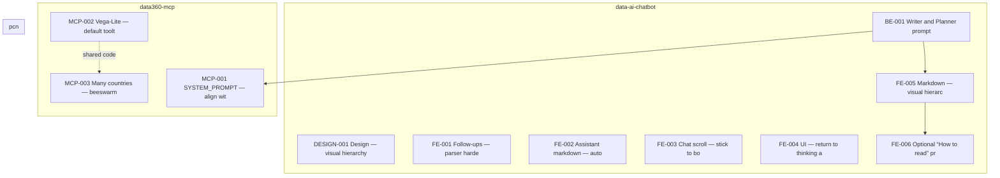

# Cross-repo task dependencies

Tasks live in:
- `data-ai-chatbot/TODO/`
- `data360-mcp/TODO/`
- `pcn/TODO/`

## Combined graph

## Edge reference

| From | To | Relationship |
|------|----|--------------|
| BE-001 | FE-005 | **Unblocks** |
| FE-005 | FE-006 | **Unblocks** |
| BE-001 | MCP-001 | **Unblocks** |
| MCP-002 | MCP-003 | **Soft order** (shared code) |

## Suggested batch order

1. **BE-001, DESIGN-001, FE-001, FE-002, FE-003, FE-004, MCP-002, MCP-003** (data-ai-chatbot, data360-mcp)
2. **FE-005, MCP-001** (data-ai-chatbot, data360-mcp)
3. **FE-006** (data-ai-chatbot)
