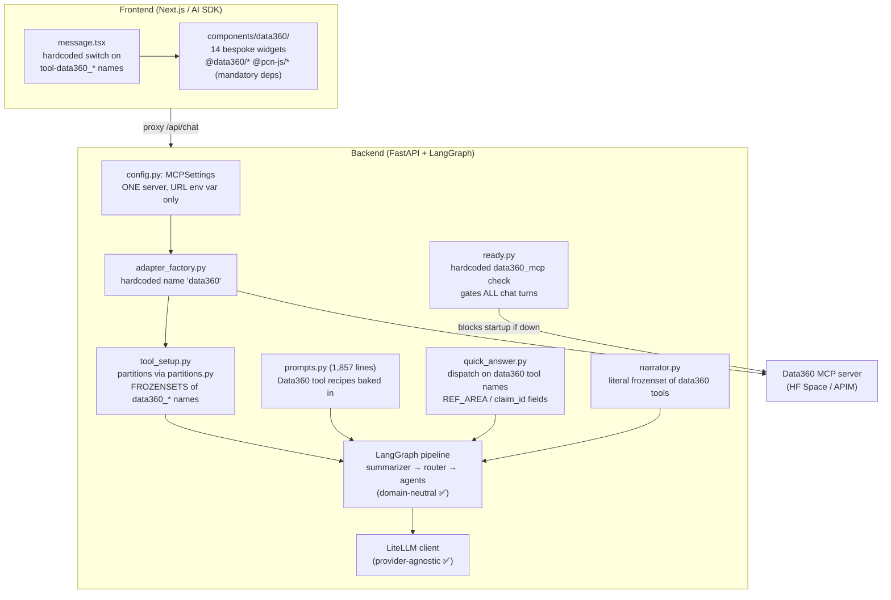
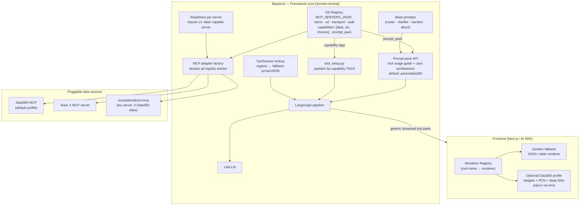

# Modularization & Reproducibility Plan

**Status:** Proposed (draft for review)
**Scope:** Full stack (backend + frontend + docs)
**Key decisions:** Multi-server MCP registry · Data360 remains the default out-of-the-box profile
**Author:** Proposed by opencode analysis, 2026-08-31

---

## Table of Contents

1. [Executive Summary](#1-executive-summary)
2. [Why (the rationale)](#2-why-the-rationale)
3. [Architecture Diagrams](#3-architecture-diagrams)
4. [The Plugin Contract](#4-the-plugin-contract)
5. [Phased Implementation](#5-phased-implementation)
6. [Verification](#6-verification)
7. [Risks & Trade-offs](#7-risks--trade-offs)
8. [Open Items](#8-open-items)

---

## 1. Executive Summary

This repository (World Bank **Data360 Chat**) is a fork of the Vercel AI Chatbot re-architected as an MCP-driven data chatbot. The README and docs already market it as reusable — *"Any other MCP server can be plugged in by changing `MCP_SERVER_URL`"* — but today only the **endpoint** is configurable. Everything downstream of the connection assumes Data360: tool names, prompts, card synthesis, frontend widgets, readiness gating.

The foundation for reuse is already in place and well-tested: MCP client plumbing (`langchain-mcp-adapters`), provider-agnostic LLMs (LiteLLM), and a domain-neutral LangGraph intent-routing pipeline. **Making data sources truly pluggable requires refactoring 4–5 well-defined seams, not a rewrite.**

**Target:** a *datasource plugin contract*. Another team clones the repo, supplies their own MCP server(s) via config (+ optional prompt pack / renderers), and runs end-to-end. Data360 ships as the default profile; current behavior is fully preserved. Reproducibility is demonstrated by a reference implementation: an example toy MCP server that works out of the box with zero Data360 dependency.

---

## 2. Why (the rationale)

### 2.1 Why MCP is the right extensibility mechanism

MCP already decouples *tool discovery and execution* from the app. The backend normalizes all MCP tools into LangChain tools and streams generic tool parts to the AI-SDK frontend. This means the plugin layer is **incremental** — we formalize what is implicitly true rather than inventing a new plugin system.

### 2.2 Why the current code is not yet reusable — 7 coupling points

| # | Coupling | Location | Why it breaks reuse |
|---|----------|----------|---------------------|
| 1 | Single hardcoded server named `"data360"` | `backend/app/ai/mcp_tools/adapter_factory.py:23,136`, `backend/app/ai/mcp_tools/data360_mcp.py`, `backend/app/ready.py:14` | Only one connection exists despite using a multi-server client; readiness literally checks for data360 |
| 2 | Hardcoded frozensets of `data360_*` tool names | `backend/app/ai/mcp_tools/partitions.py:5-31`, `backend/app/api/v1/utils/tool_setup.py:88-132` | Tool routing (data vs viz vs choices) fails for any other naming scheme |
| 3 | 1,857-line prompt file teaching Data360 recipes | `backend/app/ai/prompts.py:17-529` | The agent's "knowledge" of the data source is baked in; other teams inherit useless and contradictory instructions |
| 4 | Card synthesizer dispatching on exact tool names + `REF_AREA`/`claim_id` fields | `backend/app/ai/graph/nodes/quick_answer.py:206,442,504,610` | Quick-answer cards silently break; no fallback for foreign tool outputs |
| 5 | Narrator's "data-bearing tools" literal frozenset | `backend/app/ai/graph/nodes/narrator.py:103-114` | Narrator ignores data results from any other server |
| 6 | Frontend per-tool widget switch + `tool-data360_` prefix + `@data360/*`, `@pcn-js/*` deps | `frontend/components/message.tsx:532-700`, `frontend/lib/tool-display.ts:4-58`, `frontend/package.json:45-52` | Unknown tools get no rendering; Data360 packages are mandatory build dependencies |
| 7 | Readiness gate hardcoded to data360 | `backend/app/ready.py:14-80` | All chat turns are blocked unless *Data360 specifically* is reachable |

### 2.3 Why each design decision

- **Multi-server registry (not single swappable server):** a team may combine Data360 with its own source (e.g., institutional statistics + data360 for benchmarks). A registry generalizes the existing `MultiServerMCPClient` usage almost for free; a single-server design would be a simplification we'd have to undo later.
- **Capability tags (not hardcoded name lists):** tool routing needs *some* signal to decide which tools go to which agent. Tags declared per server (`[data, viz, choices]`) replace name matching while staying simple — no dependency on MCP tool annotations being standardized first.
- **Prompt packs (not one giant prompt):** the domain knowledge in `prompts.py` is real value — it just belongs to the *datasource*, not the *framework*. Splitting into base + per-source pack lets each team own their pack without touching pipeline logic.
- **Renderer registry with generic fallback (not only Data360 widgets):** guarantees every MCP tool renders *something* (JSON/table) even without custom UI — the key property that makes "plug in your server and it works" true.
- **Data360 as default profile (not removed):** zero regression for existing deployments; it doubles as the living reference implementation of the plugin contract.

---

## 3. Architecture Diagrams

### 3.1 Current architecture (coupled)



### 3.2 Target architecture (plugin contract)



---

## 4. The Plugin Contract

A datasource plugin = **one registry entry + optional extensions**, nothing more:

```
MCP connection        url · transport (sse/http) · headers · bearer/APIM auth · ssl
capability tags       which agent receives its tools: data | viz | choices
prompt pack           optional — tool usage guide + card synthesizers (default: data360)
frontend renderers    optional — per-tool widgets; otherwise generic JSON/table fallback
```

Teams never touch framework code; they only supply config (+ optional extensions).

---

## 5. Phased Implementation

Each phase is independently mergeable; behavior is fully preserved for the Data360 profile at every step.

### Phase 1 — Backend multi-server MCP registry

- Replace single `MCPSettings` (`backend/app/config.py:236-300`) with a registry: `MCP_SERVERS_JSON` (list of `{name, url, transport, headers_json, authorization_bearer, ssl_verify, internal, auth_scope, capabilities}`); existing single `MCP_*` env vars accepted as a legacy/default entry (backward compatible).
- Generalize `adapter_factory.py` (iterate all entries), per-server tool bundle cache in `data360_mcp.py`, per-server readiness in `ready.py`.
- Deprecate the duplicate FastMCP client path (`backend/app/ai/mcp_tools/_client.py` / `backend/app/utils/stream.py`) in favor of the adapter factory.
- **Tests:** extend `backend/tests/test_mcp_adapter_integration.py`; new registry parsing/validation tests.

### Phase 2 — Capability tags replace hardcoded tool names

- Delete `partitions.py` frozensets; partitioning in `tool_setup.py:88-132` driven by registry capability tags (naming-convention fallback for untagged servers).
- `narrator.py:103-114` derives its "data-bearing" set from tags.
- Readiness gating: chat requires ≥1 `data`-capable server, not data360 specifically.
- `backend/app/api/v1/mcp_tools.py` lists tools per server.

### Phase 3 — Prompt packs *(heaviest item)*

- Split `prompts.py` into domain-neutral base + pluggable per-datasource "tool usage guide" loaded via registry (`prompt_pack` key; default bundled `backend/app/ai/packs/data360.py`).
- Extract the Data360 card synthesizer (`quick_answer.py:206-610`) into the pack; registry lookup with generic prose/JSON fallback when no synthesizer matches.
- PCN / `claim_id` handling becomes pack-owned behavior.

### Phase 4 — Frontend renderer registry *(largest surface area)*

- Replace the `message.tsx:532-700` switch with a registry keyed by tool name + **generic JSON/table fallback**; remove the `tool-data360_` prefix assumption (`frontend/lib/tool-display.ts`).
- Move `frontend/components/data360/` into an optional profile loaded only when `NEXT_PUBLIC_DATASOURCE_PROFILE=data360`; PCN badges and indicator deep-links (`frontend/lib/data360/`) become opt-in via env.
- `@data360/*` / `@pcn-js/*` deps remain but are isolated behind the profile — a team can build without them.

### Phase 5 — Reproducibility artifacts & docs

- `examples/demo-mcp/`: minimal toy MCP server (2–3 tools with output schemas) + example prompt pack + sample `MCP_SERVERS_JSON` → `docker compose up` end-to-end with **zero Data360 dependency**.
- New doc: `docs/extensibility/onboarding-your-mcp-server.md` (registry schema, capability tags, prompt pack API, renderer registration).
- Align README/docs claims with reality; document the "profiles" concept in env docs.

---

## 6. Verification

| Layer | Check |
|-------|-------|
| Backend | `pytest backend/tests` — MCP adapter, quick-answer card, and prompt tests updated per phase; new registry tests |
| Frontend | `pnpm lint`, `pnpm build` — **both** with Data360 profile enabled and disabled |
| E2E smoke | Full run against (a) Data360 default profile, (b) `examples/demo-mcp` toy server |

---

## 7. Risks & Trade-offs

| Risk | Mitigation |
|------|------------|
| Prompt decoupling may degrade Data360 answer quality (prompts are heavily tuned) | Data360 pack is a faithful extraction, not a rewrite; existing evals harness (`backend/evals/`) used to compare before/after |
| Two MCP client implementations today (adapter factory vs FastMCP `_client.py`) | Phase 1 consolidates on the adapter factory; legacy path deprecated behind a flag |
| Config complexity grows with `MCP_SERVERS_JSON` | Legacy single-server env vars keep working; JSON schema validated at startup with clear errors; docs include copy-paste examples |
| Frontend profile loading adds build complexity | Profile is a simple env-gated dynamic import; fallback renderer ensures correctness with profile off |
| Scope creep on widget porting | Data360 widgets are *moved*, not redesigned, in Phase 4 |

---

## 8. Open Items

1. **Registry format** — `MCP_SERVERS_JSON` env var (recommended, consistent with existing env-only config) vs. a YAML config file (nicer for multi-server editing, but introduces a new config mechanism). Default to `MCP_SERVERS_JSON` unless raised.
2. **Legacy streaming path retirement** — confirm no deployment still relies on `app/utils/stream.py` before deprecating in Phase 1.
