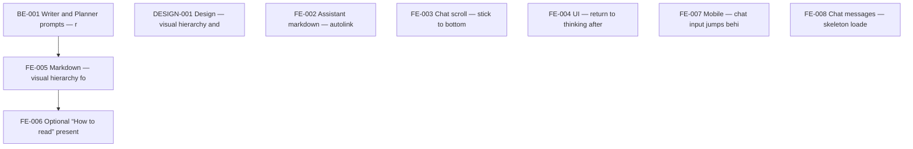

# data-ai-chatbot — task index

Agent-oriented work items. Each task is a standalone `.md` file with context, acceptance criteria, and dependency metadata. (9 active, 1 completed)

**Sibling repos:** [data360-mcp/TODO](../data360-mcp/TODO/README.md), [pcn/TODO](../pcn/TODO/README.md)

## Task IDs

| ID | File | Summary |
|----|------|---------|
| BE-001 | [BE-001-writer-planner-prompts.md](./BE-001-writer-planner-prompts.md) | Align model output with the agreed structure: Summary → optional Visualizatio... |
| DESIGN-001 | [DESIGN-001-visual-hierarchy-spec.md](./DESIGN-001-visual-hierarchy-spec.md) | Produce lightweight specs: typography scale for section titles, spacing, opti... |
| FE-002 | [FE-002-markdown-autolinks.md](./FE-002-markdown-autolinks.md) | Ensure raw URLs in assistant markdown render as clickable links when the mode... |
| FE-003 | [FE-003-scroll-while-thinking.md](./FE-003-scroll-while-thinking.md) | Keep the main chat viewport aligned with the latest activity while the system... |
| FE-004 | [FE-004-view-thinking-after-complete.md](./FE-004-view-thinking-after-complete.md) | After the assistant message finishes, users can easily reopen the thinking pr... |
| FE-005 | [FE-005-markdown-section-hierarchy.md](./FE-005-markdown-section-hierarchy.md) | Strengthen visual hierarchy for model-emitted sections: spacing, typography, ... |
| FE-006 | [FE-006-how-to-read-disclosure.md](./FE-006-how-to-read-disclosure.md) | If the model emits How to read (or equivalent) per BE-001, present it as seco... |
| FE-007 | [FE-007-mobile-keyboard-input-layout.md](./FE-007-mobile-keyboard-input-layout.md) | On iPhone (~390px viewport, iOS Safari), tapping the chat input field causes ... |
| FE-008 | [FE-008-chat-list-skeleton-loader.md](./FE-008-chat-list-skeleton-loader.md) | When the sidebar chat history list is fetching its first page of data, it sho... |

1 done

| ID | File | Summary |
|----|------|---------|
| FE-001 | [FE-001-follow-ups-parser-and-chips.md](./FE-001-follow-ups-parser-and-chips.md) | Make suggested follow-ups reliably interactive and visually obvious: parsing ... ✓ done |

## Dependency graph (this repo)

## Cross-repo dependencies

See **[CROSS-REPO-GRAPH.md](./CROSS-REPO-GRAPH.md)** for edges across all sibling repos and suggested execution order.

## How to use

1. Point an agent at `TODO/` or a specific task file.
2. Check `depends_on` in the task frontmatter before starting — all hard deps must be `done`.
3. Claim a task by setting `status: in_progress` and committing immediately.
4. After completing a task, set `status: done`, tick acceptance criteria checkboxes, and check `blocks` for newly unblocked tasks.
