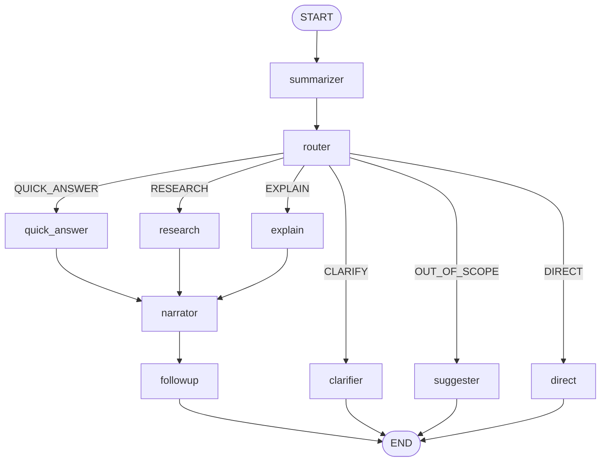
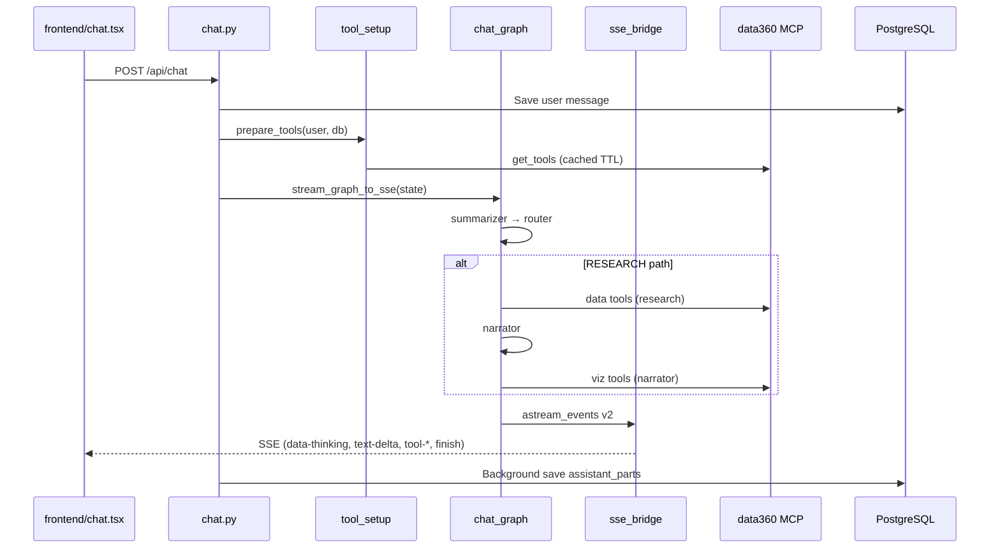

# Agents and Chat Flow — Data360 Chat

> **Status:** Current reference (repo-only; not in MkDocs nav).  
> For system architecture and scoping, see [Architecture (comprehensive)](architecture-comprehensive.md).

---

## 1. Terminology

| Term | Meaning in this codebase |
|------|--------------------------|
| **Agent** | A **LangGraph node** — an async function registered on the chat `StateGraph`, not a separate process or OpenAI Agents SDK agent. |
| **Intent** | One of six routing outcomes from `IntentType` (`backend/app/config.py`). |
| **Research packet** | Structured text produced by data nodes (`research`, `explain`, `quick_answer`) for the narrator to write the final answer. |
| **Thinking panel** | Collapsible UI region fed by SSE `data-thinking` parts (tool use + intermediate LLM text). |

**Not in production path:**

- `backend/app/ai/_agents.py` — OpenAI Agents SDK experiment (`thinking_agent`); **not imported** by the app.
- Legacy nodes `scout`, `planner`, `transformer`, `recovery` — exist under `backend/app/ai/graph/nodes/` but are **not wired** in `pipeline.py` (logic consolidated into `research_node`).
- `backend/app/utils/stream.py` — older single-LLM streaming; used by evals, not primary `POST /api/chat`.

---

## 2. Pipeline topology

Source: `backend/app/ai/graph/pipeline.py` — module-level singleton `chat_graph = build_chat_graph()`.



**Data paths** (all end with narrator → followup): `QUICK_ANSWER`, `RESEARCH`, `EXPLAIN`.  
**Terminal paths** (no narrator): `CLARIFY`, `OUT_OF_SCOPE`, `DIRECT`.

---

## 3. Per-node reference

| Node | File | Purpose | Trigger | MCP / local tools | Model | SSE surface |
|------|------|---------|---------|-------------------|-------|-------------|
| **summarizer** | `nodes/summarizer.py` | Rolling compression of long history into `session_summary` | Every turn; LLM only if history > 20 msgs (first) or ≥ 8 new msgs since last summary | None | `CHAT_MODEL` | Hidden (non-streaming) |
| **router** | `nodes/router.py` | Intent classification | After summarizer | None | `ROUTING_MODEL` (JSON mode) | `data-thinking` (routing reasoning) |
| **quick_answer** | `nodes/quick_answer.py` | Fast data fetch (1–3 tool rounds typical) | `QUICK_ANSWER` | MCP **data** partition | `CHAT_MODEL` / user-selected | Thinking panel |
| **research** | `nodes/research.py` | Adaptive data retrieval (up to 10 tool iterations) | `RESEARCH` or `@wdr` override | MCP **data** partition | `CHAT_MODEL` | Thinking panel |
| **explain** | `nodes/explain.py` | Definitions/methodology via metadata tools only | `EXPLAIN` | Subset: search, metadata, list | `CHAT_MODEL` | Thinking panel |
| **narrator** | `nodes/narrator.py` | Writer: prose + charts from research packet | After quick_answer / research / explain | MCP **viz** + optional **local** docs | `CHAT_MODEL` | Answer text + viz tool parts |
| **followup** | `nodes/followup.py` | 2–3 suggested follow-up questions | After narrator | None | `CHAT_MODEL` | Appended to answer (non-streaming) |
| **direct** | `nodes/direct.py` | Greetings, thanks, simple chat | `DIRECT` | Local docs if `ENABLE_LOCAL_TOOLS` | `CHAT_MODEL` | Answer text |
| **clarifier** | `nodes/clarifier.py` | Single clarifying question | `CLARIFY` | None | `CHAT_MODEL` | Answer text |
| **suggester** | `nodes/suggester.py` | Bridge off-topic queries to data questions | `OUT_OF_SCOPE` | None | `CHAT_MODEL` | Answer text |

### Summarizer thresholds

| Constant | Value | Behavior |
|----------|-------|----------|
| `SUMMARIZE_THRESHOLD` | 20 | First summarization when `len(openai_messages) > 20` |
| `SUMMARIZE_INCREMENT` | 8 | Re-summarize when 8+ new messages since last summary |
| `_HISTORY_WINDOW` | 30 | Recent messages passed to summarizer LLM |

### Explain tool subset

Only these MCP tools (subset of data partition):

- `data360_search_indicators`
- `data360_get_metadata`
- `data360_list_indicators`

No row-level `data360_get_data` and no viz tools in explain.

---

## 4. Routing logic

### 4.1 Intent enum

```python
# backend/app/config.py
class IntentType(str, Enum):
    QUICK_ANSWER = "QUICK_ANSWER"
    RESEARCH = "RESEARCH"
    DIRECT = "DIRECT"
    CLARIFY = "CLARIFY"
    OUT_OF_SCOPE = "OUT_OF_SCOPE"
    EXPLAIN = "EXPLAIN"
```

### 4.2 Router node (`router_node`)

Execution order in `backend/app/ai/graph/nodes/router.py`:

1. **`@wdr` in query** (case-insensitive) → force `RESEARCH` without LLM call. Comment references WDR research; **no wdr2026-mcp server** is connected in this repo.
2. **`forced_intent` in state** → skip LLM; used by `POST /api/v1/chat/stream` with `IntentType.DIRECT`.
3. **Otherwise** → `check_intent()` in `backend/app/ai/routing.py`.

### 4.3 `check_intent()` behavior

| Aspect | Detail |
|--------|--------|
| Model | `ROUTING_MODEL` (default `gpt-4o-mini`) via `get_routing_llm()` |
| History | Last `ROUTING_HISTORY_LIMIT` messages (default 10) |
| Context | Optional `session_summary` prepended for truncated history |
| Output | JSON: `intent`, `reasoning`, `missing_slots` (CLARIFY), `detected_language` |
| Content cleanup | Strips routing UX strings from prior turns before classification |

### 4.4 Routing prompt

`get_routing_system_prompt()` in `backend/app/ai/prompts.py` defines rules for all six intents, including when to prefer `QUICK_ANSWER` vs `RESEARCH` vs `EXPLAIN`.

---

## 5. Prompt map

| Prompt function | Node(s) | Wired in pipeline? |
|-----------------|---------|-------------------|
| `get_summarizer_system_prompt()` | summarizer | Yes |
| `get_routing_system_prompt()` | router (via `check_intent`) | Yes |
| `get_quick_answer_system_prompt()` | quick_answer | Yes |
| `get_research_agent_system_prompt()` | research | Yes (`get_thinking_system_prompt` is alias) |
| `get_explain_system_prompt(language)` | explain | Yes |
| `get_system_prompt(...)` | narrator | Yes (Writer) |
| `get_followup_system_prompt(language)` | followup | Yes |
| `get_direct_system_prompt(language)` | direct | Yes |
| `get_clarifier_system_prompt(language)` | clarifier | Yes |
| `get_suggester_system_prompt(language)` | suggester | Yes |
| `get_scout_system_prompt()` | scout | **No** |
| `get_planner_system_prompt()` | planner | **No** |
| `get_recovery_system_prompt()` | recovery | **No** |
| `get_transformer_system_prompt()` | transformer | **No** |

Language-aware prompts receive `detected_language` from router state when set.

Backup prompts: `backend/app/ai/prompts.bak.py`.

---

## 6. MCP tool partitions

Defined in `backend/app/ai/mcp_tools/partitions.py`. Loaded at chat start via `prepare_tools()` → `get_mcp_tool_bundle()`.

### Data tools (`DATA_TOOL_NAMES`)

Used by **research**, **quick_answer**, and partially by **explain**:

| Tool name |
|-----------|
| `data360_search_indicators` |
| `data360_get_metadata` |
| `data360_get_data` |
| `data360_get_disaggregation` |
| `data360_find_codelist_value` |
| `data360_list_indicators` |
| `data360_get_data_api_url` |
| `data360_expand_country_group` |
| `data360_summarize_data` |
| `data360_rank_countries` |
| `data360_compare_countries` |

### Viz tools (`VIZ_TOOL_NAMES`)

Used by **narrator** only:

| Tool name |
|-----------|
| `data360_get_viz_spec` |
| `data360_get_multi_indicator_viz_spec` |
| `data360_get_supported_chart_types` |

### Local tools (`ENABLE_LOCAL_TOOLS`, default false)

| Tool | Purpose |
|------|---------|
| `createDocument` | Create text/code/sheet artifact |
| `updateDocument` | Update existing artifact |

Wrapped as LangChain `StructuredTool` in `backend/app/api/v1/utils/tool_setup.py`.

### MCP client

- **LangGraph path:** `langchain-mcp-adapters` `MultiServerMCPClient`, server name `"data360"` (`adapter_factory.py`).
- **Legacy path:** FastMCP client (`_client.py`) for `utils/stream.py` and evals.
- **Config:** `MCP_*` env vars → `MCPSettings` in `config.py`.

---

## 7. End-to-end sequence



### Entry points

| Endpoint | Routing | Notes |
|----------|---------|-------|
| `POST /api/chat` | Full router | Production chat |
| `POST /api/v1/chat/stream` | `forced_intent=DIRECT` | Skips router LLM; direct node only |
| `GET /api/chat/{id}/stream` | N/A | Resume tail from Redis (`chat_resume.py`) |

---

## 8. State model

`ChatPipelineState` in `backend/app/ai/graph/state.py`:

| Field | Set by | Consumed by |
|-------|--------|-------------|
| `openai_messages`, `model_type`, `query_text`, `message_id`, `tool_set` | `chat.py` (input) | All nodes |
| `intent`, `routing_reasoning`, `missing_slots`, `detected_language` | router | Conditional edges, language prompts |
| `forced_intent` | `chat_stream.py` / graph input | router (fast path) |
| `session_summary`, `summarized_message_count` | summarizer | router, data nodes |
| `research_packet`, `research_tool_results` | research / explain / quick_answer | narrator |
| `response_mode`, `quick_answer_card` | quick_answer | narrator, SSE (card payload) |
| `clarification_question` | clarifier | SSE answer |
| `suggestions` | suggester | telemetry |
| `followup_questions` | followup | Appended to answer |
| `assistant_parts`, `final_usage` | sse_bridge / nodes | DB save |
| `_tool_sse_queue` | chat.py | Manual tool lifecycle in SSE bridge |

---

## 9. SSE bridge and frontend contract

### 9.1 Event mapping (`sse_bridge.py`)

| `langgraph_node` | Stream target | Part types |
|------------------|---------------|------------|
| `router` | Thinking | `data-thinking` with routing reasoning |
| `research`, `explain`, `quick_answer`, `recovery` | Thinking | `data-thinking` + tool lifecycle |
| `narrator`, `direct`, `clarifier`, `suggester` | Answer | `text-start` / `text-delta` / `text-end` |
| Tool calls (manual queue) | Thinking or answer | `tool-input-*`, `tool-output-available` per node rules |

Thinking nodes constant: `_THINKING_NODES = {"research", "explain", "recovery", "quick_answer"}`.

Manual tool notifications via `_tool_sse_queue` prevent duplicate tool events when LangGraph also traces tool runs.

### 9.2 Frontend consumption

| Component | Role |
|-----------|------|
| `frontend/components/chat.tsx` | `useChat` + `DefaultChatTransport` → `/api/chat` |
| `frontend/hooks/use-data-thinking-stream.ts` | Accumulates `data-thinking` parts for collapsible panel |
| `frontend/components/message.tsx` | Renders tool parts, charts, legacy ai4data tool types |
| `frontend/components/data360/chart-preview.tsx` | `@data360/mcp-ui` `Data360ChartFromVizTool` |
| `frontend/lib/chart-url.ts` | Proxied `/api/v1/charts/{id}` fetch for Vega |
| `frontend/lib/tool-display.ts` | Tool labels and display metadata |

### 9.3 Viz tool output shape

Successful viz tools return `{ "url": "/api/v1/charts/{uuid}/...", "error": null }`. UI detects chart URLs in prose and tool outputs and embeds Vega specs.

### 9.4 Quick answer card

When `quick_answer_card` is set in final graph state, SSE bridge can emit card payload for specialized renderers (`quick-answer.tsx`).

---

## 10. Models and user selection

| Config key | Default role |
|------------|--------------|
| `CHAT_MODEL` | All graph nodes except router |
| `CHAT_MODEL_REASONING` | User selects `chat-model-reasoning` in UI |
| `ROUTING_MODEL` | Router only (`gpt-4o-mini`) |
| `TITLE_MODEL` | Chat title generation in `chat.py` |

Factory: `backend/app/ai/graph/llm_factory.py` (`ChatLiteLLM` / LiteLLM, `MODEL_PROVIDER` prefix e.g. `azure/`).

Token usage: `backend/app/ai/observability/token_usage.py` → stored in chat `lastContext`.

---

## 11. Legacy and unwired code

| Item | Location | Status |
|------|----------|--------|
| scout, planner, recovery, transformer nodes | `graph/nodes/*.py` | Not in `pipeline.py` |
| `_agents.py` | `backend/app/ai/_agents.py` | Unused OpenAI Agents SDK sample |
| `stream_text()` | `backend/app/utils/stream.py` | Legacy single-LLM path; evals |
| `StreamEventProcessor` | `backend/app/utils/stream_processor.py` | Legacy; sse_bridge mirrors shapes for DB |
| Frontend prompts | `frontend/lib/ai/prompts.ts` | Artifacts/title only; chat prompts are backend |

---

## 12. Tests and debugging

| Test file | Covers |
|-----------|--------|
| `backend/tests/test_router_node.py` | `@wdr`, forced intent, routing |
| `backend/tests/test_graph_stream.py` | SSE graph streaming |
| `backend/tests/test_mcp_adapter_integration.py` | MCP adapter |
| `backend/tests/test_mcp_apim_auth.py` | APIM bearer auth |

Debug logging: `GRAPH_DEBUG_LOG` / `graph_debug_log.py` for raw LangGraph events.

API: `GET /api/v1/mcp/tools` lists tool schemas for inspection.

---

## 13. Related documentation

- [Architecture (comprehensive)](architecture-comprehensive.md) — C4 diagrams, scoping, deployment
- [architecture/integrations.md](architecture/integrations.md) — MCP client configuration (MkDocs)
- [architecture/authentication.md](architecture/authentication.md) — Auth modes (MkDocs)
- [architecture/ai-streaming.md](architecture/ai-streaming.md) — **Deprecated** (RESEARCH vs DIRECT only)

---

## Document history

| Date | Change |
|------|--------|
| 2026-05-18 | Initial agent and chat flow characterization |
