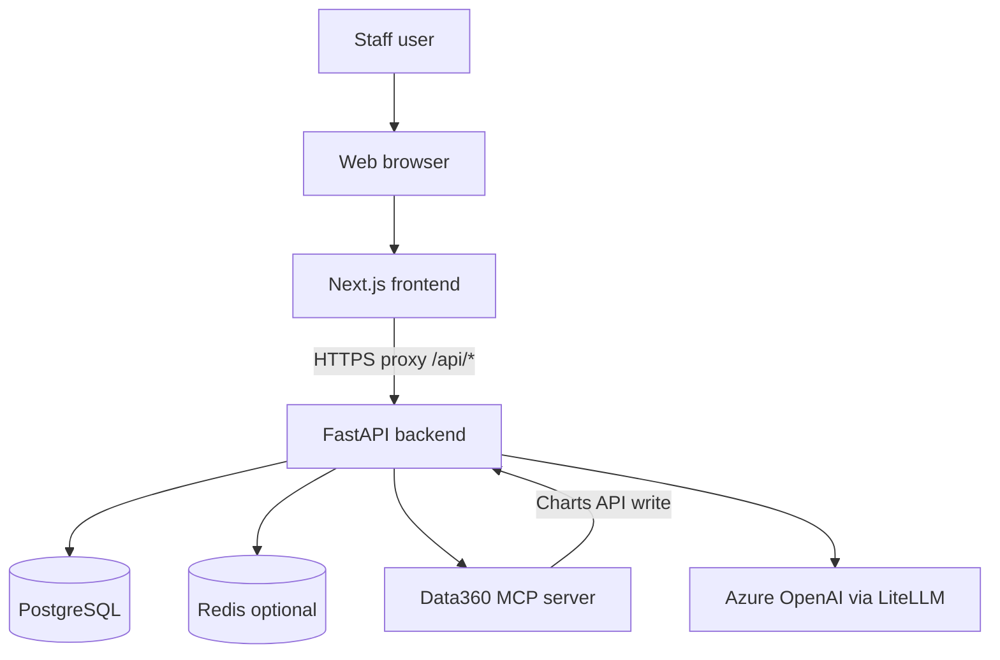
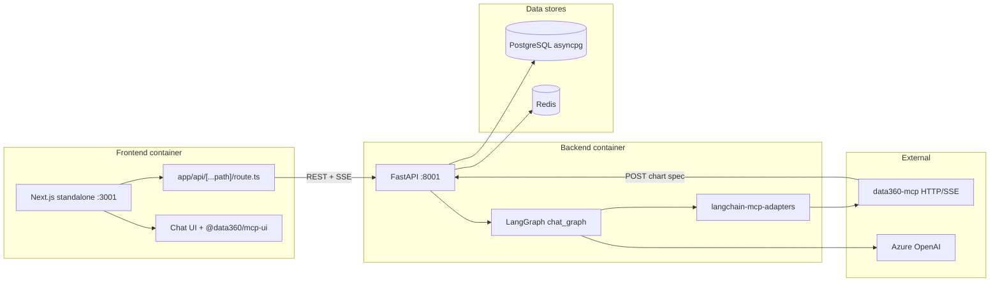
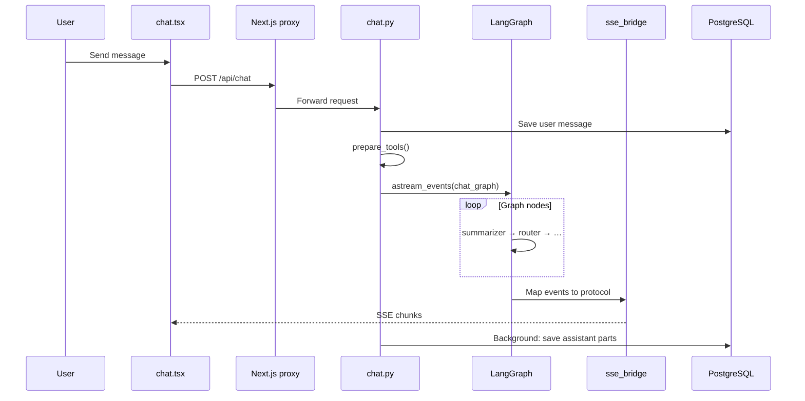
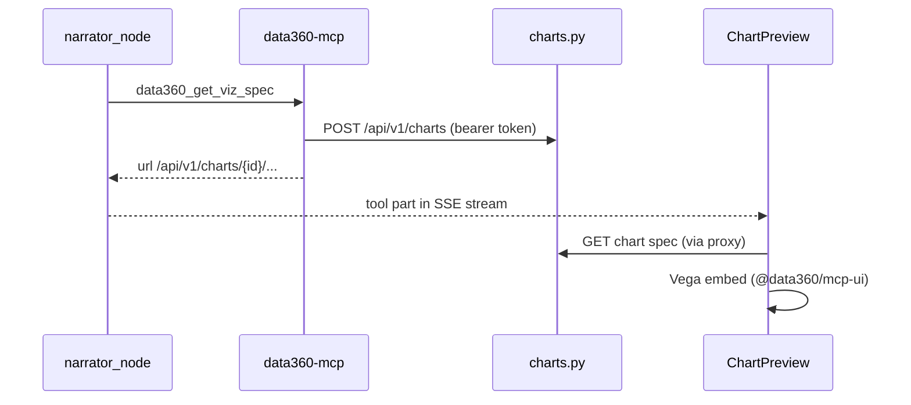
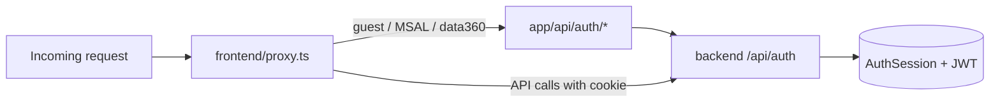
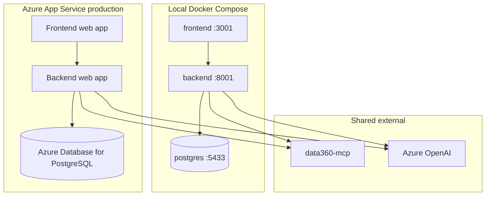
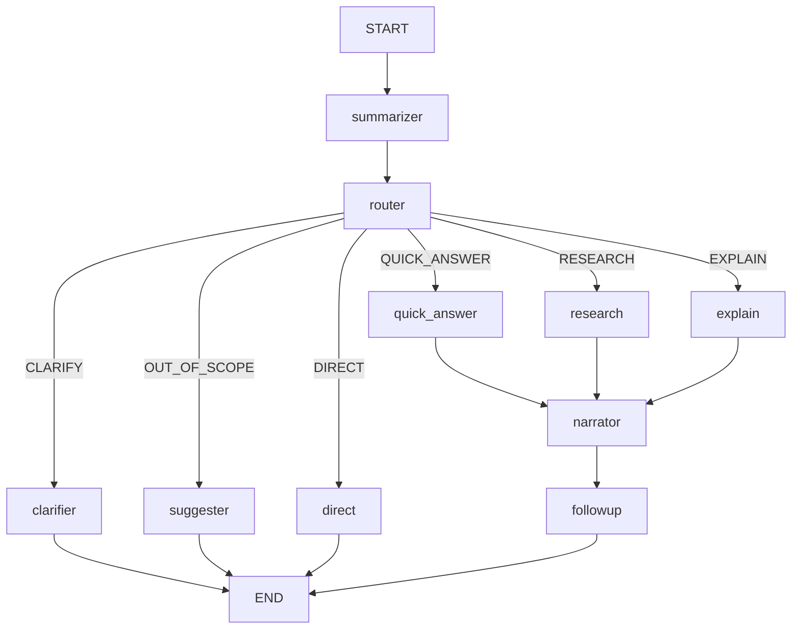

# Data360 Chat — Comprehensive Architecture and Scoping

> **Status:** Current reference (repo-only; not in MkDocs nav).  
> For agent/node behavior, see [Agents and chat flow](agents-and-chat-flow.md).

---

## 1. Executive summary

**Data360 Chat** (repository: `vercel-ai-chatbot`) is a self-hostable, full-stack conversational AI application for World Bank development data. Staff use natural language to search indicators, retrieve time series, generate charts, and work with documents.

| Aspect | Choice |
|--------|--------|
| **Frontend** | Next.js 16 (App Router), React 19, TypeScript |
| **Backend** | FastAPI (Python 3.11+), LangGraph AI pipeline, LiteLLM |
| **Data** | PostgreSQL (backend-owned); optional Redis (resumable streams) |
| **External AI/data** | Azure OpenAI (via LiteLLM), **Data360 MCP** server |
| **Reference deployment** | Azure App Service (separate frontend + backend web apps) |
| **Local development** | Docker Compose (`db`, `backend`, `frontend`; optional `redis` profile) |

The browser talks only to the Next.js origin. All API and SSE traffic is proxied to FastAPI. The backend is the authority for identity, chat persistence, and AI orchestration.

---

## 2. System context (C4 Level 1)



**Actors**

- **Staff user** — Authenticated via guest, email/password, Azure AD (MSAL), or Data360 redirect.
- **Data360 MCP server** — Exposes data and visualization tools; may write chart specs to the backend Charts API.
- **LLM provider** — Azure OpenAI (default) through LiteLLM; routing uses a smaller model (`ROUTING_MODEL`).

---

## 3. Container diagram (C4 Level 2)



| Container | Protocol | Responsibility |
|-----------|----------|----------------|
| **Next.js** | HTTPS to user; server-side fetch to backend | UI, auth cookies, CSP, API proxy |
| **FastAPI** | REST + SSE | Auth, CRUD, LangGraph, MCP client |
| **PostgreSQL** | asyncpg / SQLAlchemy 2 async | Users, chats, messages, charts, sessions |
| **Redis** | Redis protocol (optional) | Stream chunk storage for resume |
| **Data360 MCP** | MCP over HTTP/SSE | Indicator search, data fetch, viz specs |
| **Azure OpenAI** | HTTPS (LiteLLM) | Chat, routing, summarization, narration |

---

## 4. Component scoping

What this repository owns versus what lives elsewhere.

| Area | In scope (this repo) | Out of scope (explicit) |
|------|----------------------|-------------------------|
| **Chat AI** | LangGraph pipeline (`backend/app/ai/graph/`), 6-intent router, MCP data/viz partitions | **wdr2026-mcp** (no server wired; `@wdr` only forces RESEARCH intent). OpenAI Agents SDK stub in `backend/app/ai/_agents.py` (unused). |
| **MCP** | Single logical server `data360` via `MCP_*` env; LangChain + FastMCP clients | Cursor IDE MCP configs, `plugins/figma/` Codex plugin |
| **Visualization** | `@data360/mcp-ui`, Charts API (`/api/v1/charts`), Vega embed in frontend | MCP ext-apps iframe HTML pattern |
| **Auth** | guest / user / msal / data360 (`NEXT_PUBLIC_AUTH_PROVIDER`) | External IdP configuration outside env templates |
| **Persistence** | Backend Postgres + Alembic | Frontend DB access (deprecated `frontend/lib/db/`) |
| **PCN** | `@pcn-js/*` claim extractors in UI | PCN verification backend (separate packages) |
| **Deployment** | Docker Compose for dev; docs for Azure App Service | Production infra-as-code not in this repo |

---

## 5. Repository map

```
vercel-ai-chatbot/
├── frontend/                 # Next.js 16 application
│   ├── app/
│   │   ├── (chat)/           # Chat pages: /, /chat/[id]
│   │   ├── (auth)/           # login, register
│   │   └── api/
│   │       ├── [...path]/    # Catch-all proxy → FastAPI
│   │       └── auth/         # Auth helpers (me, logout, MSAL token)
│   ├── components/           # Chat UI, data360 charts, sidebar, messages
│   ├── lib/                  # env schema, api-client, auth, ai metadata
│   ├── hooks/                # use-data-thinking-stream, use-messages, …
│   ├── artifacts/            # Vercel AI SDK artifact types (chart, code, …)
│   └── environments/         # .env.dev, .env.qa, .env.prod presets
├── backend/
│   ├── app/
│   │   ├── main.py           # FastAPI app, routers, middleware
│   │   ├── config.py         # Pydantic settings (MCP, models, intents)
│   │   ├── api/v1/           # REST + SSE endpoints
│   │   ├── ai/               # LangGraph, prompts, routing, MCP tools
│   │   ├── models/           # SQLAlchemy models
│   │   ├── db/queries/       # Async query layer
│   │   └── core/             # auth, CSRF, rate limit, redis, database
│   ├── alembic/              # DB migrations
│   └── tests/                # pytest (router, graph stream, MCP auth)
├── docs/                     # MkDocs site + repo-only references (this file)
├── docker-compose.yml        # db + backend + frontend (+ redis profile)
└── mkdocs.yml                # Published documentation config
```

### Key entry points

| Path | Role |
|------|------|
| `frontend/app/layout.tsx` | Root layout, fonts, auth provider, Data360 header script |
| `frontend/proxy.ts` | Auth redirects, CSP, maintenance, route protection |
| `frontend/app/api/[...path]/route.ts` | Forwards `/api/*` to `SERVER_API_URL` |
| `frontend/components/chat.tsx` | `useChat` → `POST /api/chat` |
| `backend/app/main.py` | Router registration, middleware, `/health`, `/ready` |
| `backend/app/api/v1/chat.py` | Primary chat endpoint (LangGraph + SSE) |
| `backend/app/ai/graph/pipeline.py` | LangGraph topology and `chat_graph` singleton |

---

## 6. Request and data flows

### 6.1 Chat turn (primary path)



1. Browser `useChat` posts to same-origin `/api/chat`.
2. Next.js catch-all proxy forwards to FastAPI (`SERVER_API_URL` in Docker, `NEXT_PUBLIC_API_URL` locally).
3. Handler authenticates, loads/creates chat, persists user message, converts history to OpenAI format.
4. `prepare_tools()` loads MCP tool bundle (cached) and optional local document tools.
5. `stream_chat_graph_sse()` runs `chat_graph` and maps `astream_events` to SSE via `sse_bridge.py`.
6. Background task saves assistant message parts and token usage (`lastContext`).

### 6.2 Visualization path



Chart specs are stored in PostgreSQL by the MCP server (or backend on its behalf). The frontend fetches specs through the proxied Charts API and renders with `@data360/mcp-ui` / `vega-embed`.

### 6.3 Authentication path



Auth modes are selected by `NEXT_PUBLIC_AUTH_PROVIDER`: `guest`, `user`, `msal`, or `data360`. Backend resolves identity via JWT cookie, `Authorization` header, MSAL cookie, or opaque session tokens (`AuthSession` table).

---

## 7. API surface summary

Routers are registered in `backend/app/main.py`.

| Method / path | Module | Purpose |
|---------------|--------|---------|
| `POST /api/chat` | `chat.py` | Create/continue chat; **full intent routing**; SSE stream |
| `GET /api/chat/{id}` | `chat.py` | Get chat metadata |
| `GET /api/chat/{id}/messages/latest` | `chat.py` | Latest messages (incl. thinking parts after reload) |
| `GET /api/chat/{id}/stream` | `chat_resume.py` | Resume Redis-backed stream |
| `POST /api/v1/chat/stream` | `chat_stream.py` | Stream with **`forced_intent=DIRECT`** (skips router LLM) |
| `GET /api/history` | `history.py` | Chat list |
| `POST/GET /api/vote` | `vote.py` | Message votes |
| `POST /api/feedback` | `feedback.py` | App feedback |
| `GET/POST /api/document` | `document.py` | Document artifacts |
| `POST/GET /api/v1/charts` | `charts.py` | Chart spec storage (MCP writes, UI reads) |
| `POST/GET /api/files` | `files.py` | File attachments |
| `GET /api/v1/mcp/tools` | `mcp_tools.py` | MCP tool definitions (debug/UI) |
| `GET /api/models` | `models.py` | Available chat models |
| `/api/auth/*` | `auth.py` | Login, register, guest, refresh, me, password reset |
| `GET /health` | `main.py` | Liveness |
| `GET /ready` | `ready.py` | Readiness (DB + optional MCP probe) |

OpenAPI: `/docs` on the backend when running.

---

## 8. Configuration and environments

### Frontend (`frontend/lib/env/schema.ts`)

- Zod-validated env vars; presets: `dev`, `qa`, `uat`, `prod`.
- Key connectivity: `NEXT_PUBLIC_API_URL` (browser), `SERVER_API_URL` (server-side proxy target).
- Auth: `NEXT_PUBLIC_AUTH_PROVIDER`, MSAL/Data360 URLs, CSP, maintenance flags.
- Per-env files under `frontend/environments/`; local dev often symlinks `frontend/.env` → `environments/.env.local`.

### Backend (`backend/app/config.py`)

| Group | Examples | Purpose |
|-------|----------|---------|
| **Database** | `POSTGRES_*`, computed `POSTGRES_URL` | Async SQLAlchemy |
| **JWT / session** | `JWT_SECRET_KEY`, `SESSION_VERSION` | Auth tokens, deploy invalidation |
| **Models** | `CHAT_MODEL`, `CHAT_MODEL_REASONING`, `ROUTING_MODEL`, `TITLE_MODEL` | LiteLLM model IDs |
| **Routing** | `ROUTING_HISTORY_LIMIT` | Messages sent to routing LLM |
| **MCP** (`MCP_*`) | See below | Data360 server connection |
| **Redis** | `REDIS_URL` | Resumable streams (optional) |
| **Rate limit** | `RATE_LIMIT_*` | Per-user/IP throttling |

### MCP environment variables (`MCPSettings`, prefix `MCP_`)

| Variable | Purpose |
|----------|---------|
| `MCP_SERVER_URL` | Data360 MCP endpoint |
| `MCP_TRANSPORT` | `sse`, `http`, or auto from URL |
| `MCP_SSL_VERIFY`, `MCP_TIMEOUT`, `MCP_LOAD_TIMEOUT` | TLS and timeouts |
| `MCP_TOOLS_CACHE_TTL_SECONDS` | Tool list cache (default 300s) |
| `MCP_HEADERS_JSON`, `MCP_AUTHORIZATION_BEARER` | Extra HTTP headers |
| `MCP_INTERNAL`, `MCP_AUTH_SCOPE` | Azure AD client credentials for APIM |
| `MCP_READINESS_ENABLED`, `MCP_READINESS_TIMEOUT` | `/ready` MCP health probe |

### Docker Compose wiring

| Service | Port | Notes |
|---------|------|-------|
| `frontend` | 3001 | `SERVER_API_URL=http://backend:8001` |
| `backend` | 8001 | `POSTGRES_URL` points at `db` service |
| `db` | 5433→5432 | PostgreSQL 17 |
| `redis` (profile) | 6379 | Optional resumable streams |

---

## 9. Deployment topology



- **Local:** See `docs/deployment/local-development.md` and `docker-compose.yml`.
- **Production:** Separate Azure App Service apps for frontend and backend; see `docs/deployment/production.md`.
- **Redis:** Enable when resumable streams are required (`REDIS_URL`, `docker-compose --profile redis`).

---

## 10. Cross-repo dependencies

| Repository / package | Relationship |
|---------------------|--------------|
| **[data360-mcp](https://github.com/worldbank/data360-mcp)** | MCP server implementation; defines data/viz tools. Host UI packages `@data360/mcp-ui`, `@data360/tool-types` consumed by frontend. |
| **@pcn-js/core, @pcn-js/ui, @pcn-js/data360** | Proof-Carrying Numbers claim UI in chat (aggregation tools). |
| **ITSAI-DATA360-PY** | Sibling backend lineage; similar FastAPI/MCP patterns but not a runtime dependency of this monorepo. |
| **wdr2026-mcp** | Not integrated; `@wdr` in user text only forces RESEARCH routing in this app. |

---

## 11. AI pipeline (summary)

Production chat uses a **LangGraph StateGraph** with 10 nodes (8 active paths + START/END). Intent classification selects among six intents: `QUICK_ANSWER`, `RESEARCH`, `EXPLAIN`, `CLARIFY`, `OUT_OF_SCOPE`, `DIRECT`.



Full node characterization, prompts, MCP partitions, and SSE mapping: **[Agents and chat flow](agents-and-chat-flow.md)**.

---

## 12. Related documentation

| Document | Status |
|----------|--------|
| [Agents and chat flow](agents-and-chat-flow.md) | **Current** (repo-only) |
| [architecture/authentication.md](architecture/authentication.md) | Valid MkDocs |
| [architecture/data-persistence.md](architecture/data-persistence.md) | Valid MkDocs |
| [architecture/integrations.md](architecture/integrations.md) | Valid MkDocs (MCP client detail) |
| [architecture/frontend.md](architecture/frontend.md) | Valid MkDocs |
| [architecture/ai-streaming.md](architecture/ai-streaming.md) | **Deprecated** — superseded by agents doc |
| [architecture/overview.md](architecture/overview.md) | **Deprecated** — partial; see this file |

---

## Document history

| Date | Change |
|------|--------|
| 2026-05-18 | Initial comprehensive architecture and scoping reference |
