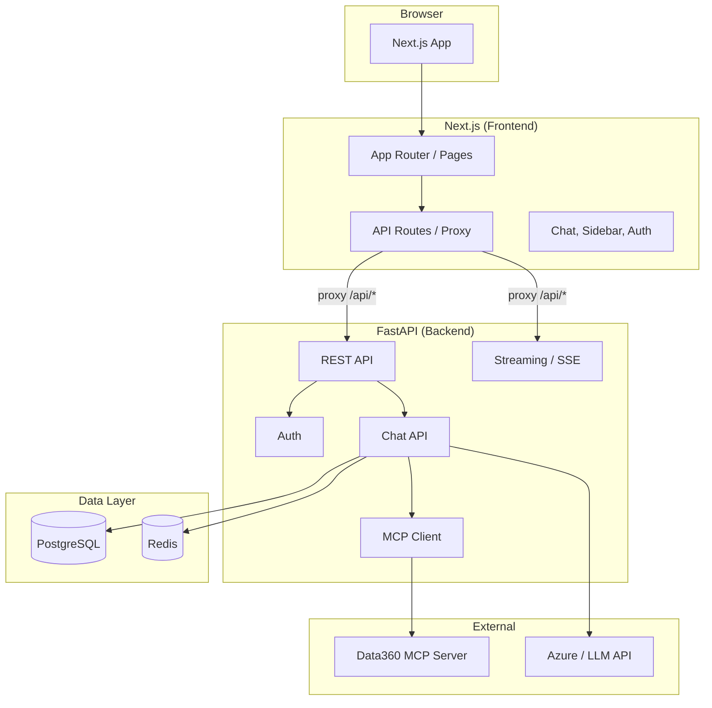

# Data360 Chat — Architecture Document

**Document type:** Architecture (summary)  
**System:** Data360 Chat (Data Chatbot)  
**Codebase:** vercel-ai-chatbot  

> **Detailed architecture:** The full architecture is documented in [Architecture](architecture/index.md) as a set of focused documents (overview, system context, backend, frontend, data, auth, AI/streaming, integrations, deployment, decisions). Use that section for in-depth reference.

---

## 1. Purpose and Scope

This document describes the architecture of **Data360 Chat**, the conversational AI application that lets users interact with development data, documents, and analytical tools through natural language. It is intended for technical leads, developers, and operations staff who need to understand how the system is structured, why key decisions were made, and how the main flows work.

**In scope:** High-level structure, backend and frontend responsibilities, authentication and authorization, chat and streaming flow, integration with Data360 MCP and LLM providers, deployment and configuration. **Out of scope:** Step-by-step runbooks, API request/response schemas in full, and product requirements (those live in product or project documentation).

---

## 2. Intended Audience

- **Developers** working on the chat backend or frontend who need context on modules, data flow, and integration points.
- **Architects and technical leads** evaluating consistency with standards, extensibility, and technical risk.
- **Operations and DevOps** planning deployment, monitoring, and environment configuration.

---

## 3. Introduction and Context

Data360 Chat exists to provide a single, user-friendly interface where staff can ask questions, create and edit documents, and explore development data (indicators, metadata, charts) without switching between multiple tools. The system is built as a **full-stack web application**: a Next.js frontend for the UI and a FastAPI backend for API, auth, and AI orchestration. Chat is stateful (conversations and history are stored), and the backend coordinates with external services—the Data360 MCP server for data and chart tools, and an LLM provider (e.g. Azure OpenAI) for generation.

The architecture reflects a few deliberate choices: **separating frontend and backend** so each can be scaled and deployed independently; **streaming responses** so users see progress and can cancel or resume; **supporting multiple auth modes** (guest, email/password, Azure AD) to fit different deployment contexts; and **treating MCP as the extension point** for data and visualization so new capabilities can be added without changing the core chat pipeline.

---

## 4. Architectural Goals and Principles

The design aims to achieve the following:

- **User experience:** Responsive, streaming chat with clear feedback (e.g. “thinking” and tool use) and persistent history with visibility controls.
- **Security and compliance:** Authentication and authorization on every request; httpOnly cookies and optional Azure AD; rate limiting and CSRF protection.
- **Maintainability:** Clear separation between API, business logic, and persistence; async I/O and a single LLM path with routing (RESEARCH vs DIRECT) rather than multiple ad-hoc pipelines.
- **Extensibility:** New tools and data sources added via MCP; local tools and MCP tools handled uniformly in the stream.

---

## 5. System Context

From a user’s perspective, the browser talks to “the app”; in reality, the browser talks to the Next.js app, which proxies API and streaming requests to the FastAPI backend. The backend is the single point that talks to the database, Redis (if used), the Data360 MCP server, and the LLM provider. There is no direct client-to-MCP or client-to-LLM connection; all tool calls and model requests go through the backend so that auth, rate limits, and logging are consistent.

The diagram below summarizes this. The user interacts only with the Next.js frontend. The frontend’s API routes act as a proxy for `/api/*`, so the backend’s base URL can be configured (e.g. same host in production or a separate host in development). PostgreSQL holds all persistent state (users, chats, messages, votes, documents, files, feedback, sessions); Redis is used for caching and, when enabled, for storing stream chunks so that a disconnected user can resume a long-running response later.

---

## 6. Technology Stack

The following table summarizes the main technologies and their role. The frontend is a React application built on Next.js 16 with the App Router; the Vercel AI SDK is used for chat state and streaming. The backend is Python (FastAPI) with async SQLAlchemy for PostgreSQL; LiteLLM provides a unified interface to the LLM provider so that model and endpoint can be changed via configuration. Data360 MCP is consumed as an external HTTP/SSE service; the backend holds no copy of indicator or chart data, only references and user-generated content.

| Layer        | Technology        | Purpose |
|-------------|-------------------|--------|
| **Frontend** | Next.js 16, React 19, TypeScript | App Router, chat UI, auth, proxy |
| **Frontend** | Tailwind, shadcn/ui, Vercel AI SDK | Styling, components, `useChat` and streaming |
| **Backend**  | FastAPI           | REST API, SSE streaming, auth, MCP client |
| **Backend**  | LiteLLM           | Unified LLM client (Azure OpenAI–compatible) |
| **Database** | PostgreSQL, SQLAlchemy (async) | Persistent storage |
| **Cache**    | Redis (optional)  | Session/cache, resumable stream chunks |
| **External** | Data360 MCP       | Tools: search indicators, metadata, data, charts |
| **External** | Azure AD (optional) | MSAL authentication |

---

## 7. Backend Architecture

The backend is the authority for identity, chat state, and AI orchestration. This section explains how it is organized and how the main flows work.

### 7.1 Entry Point and Cross-Cutting Concerns

The FastAPI application is created in `backend/app/main.py`. On startup it configures CORS, rate limiting, CSRF checks, and cache-prevention headers so that browsers and proxies do not cache sensitive or dynamic responses. A lifespan handler ensures Redis is closed cleanly on shutdown. A global exception handler normalizes error responses. All v1 routes are mounted under `/api/*`, so the frontend only needs to know the backend base URL and the path prefix.

### 7.2 Configuration

Configuration is centralized in `app/config.py` using Pydantic settings loaded from the environment. This keeps secrets and environment-specific values (database URLs, JWT secrets, Azure AD credentials, MCP server URL, model names) out of code and makes it clear what must be set per deployment. Database connection strings are built from individual `POSTGRES_*` variables so that password and host can be supplied securely. Auth can be tuned per environment (e.g. guest-only for demos, Azure AD for production).

### 7.3 Core Modules and Responsibilities

The backend is structured so that HTTP handlers stay thin and delegate to dedicated modules. **`app/core/`** holds the database engine and session factory, Redis client, JWT and session token logic, Azure AD validation, CSRF and rate-limit helpers, and shared error types. **`app/api/deps.py`** defines the dependency that resolves the current user on each request: it tries JWT first (from cookie or header), then Azure AD/MSAL cookie if configured, then session tokens stored in the database; revoked tokens and password-change invalidation are enforced, and the result can be cached for a short period to reduce DB load. **`app/models/`** contains the SQLAlchemy models for users, chats, messages, votes, documents, files, charts, streams, suggestions, auth sessions, and feedback; **`app/db/queries/`** encapsulates all persistence so that handlers and AI code work with clear async functions instead of raw SQL.

### 7.4 API Surface

The main API groups are auth, chat, history, feedback, documents, files, charts, MCP tool listing, and models. Auth covers login, registration, logout, token refresh, guest creation, password reset, and the “me” endpoint; it also exposes the route that sets the MSAL token cookie after the frontend completes the Azure AD flow. Chat is central: creating or continuing a conversation, streaming the response, fetching a chat by id, fetching latest messages, deleting chats or messages, and updating visibility. Separate routes exist for resumable streams (e.g. when Redis is used and the client reconnects with a stream id). The following table is a quick reference; the actual route modules live under `app/api/v1/`.

| Prefix            | Module         | Main endpoints |
|-------------------|----------------|----------------|
| `/api/auth`       | `auth.py`      | login, register, logout, refresh, guest, password-reset, me, MSAL set-token |
| `/api/chat`       | `chat.py`      | POST (create/continue + stream), GET `/{id}`, GET `/{id}/messages/latest`, DELETE, PATCH visibility, GET suggestions |
| `/api/v1/chat`    | `chat_stream.py`, `chat_resume.py` | POST `/stream`, resumable stream |
| `/api/history`    | `history.py`   | Chat history |
| `/api/vote`       | `vote.py`      | Message vote |
| `/api/feedback`   | `feedback.py`  | App feedback |
| `/api/document`   | `document.py`  | Documents |
| `/api/files`      | `files.py`     | File metadata |
| `/api/v1/charts`  | `charts.py`    | Charts |
| `/api/v1/mcp`     | `mcp_tools.py` | MCP tool list / proxy |
| `/api/models`     | `models.py`    | Model list |

### 7.5 Authentication Flow (Narrative)

When a user signs in (guest, email/password, or Azure AD), the backend establishes identity and sets an httpOnly cookie (e.g. `auth_token` for JWT or the MSAL cookie name for Azure AD). The frontend does not read the token; it simply sends cookies with every request. The Next.js proxy forwards those cookies to the backend. On each request, `get_current_user` runs: it first tries to validate the JWT from the cookie or the `Authorization` header; if that fails and Azure AD is configured, it validates the MSAL cookie; if that also fails, it falls back to the guest or user session token stored in the database. Revoked tokens (by JTI) and sessions invalidated after a password change are rejected. This layered approach allows the same API to support multiple auth providers and keeps token handling on the server.

### 7.6 AI and Chat Flow (Narrative)

When the user sends a message, the client POSTs to `/api/chat` with the conversation id (or empty for a new chat), the latest user message, selected model, and visibility. The backend applies rate limiting, then loads or creates the chat and saves the user message. It converts the conversation history into the format expected by the LLM (OpenAI-style messages) and runs an intent step to choose between **RESEARCH** and **DIRECT** modes. RESEARCH is used for open-ended or data-heavy questions: the system prompt includes chain-of-thought guidance, and both local tools and MCP tools (e.g. Data360 search, metadata, data, charts) are available; the stream may include “thinking” segments. DIRECT is used for simpler queries: a shorter system prompt and only local tools, no “thinking” segment. A single `stream_text()` call in `utils/stream.py` then drives the LLM: for each tool call requested by the model, the backend either runs a local function or calls the Data360 MCP server via `call_mcp_tool()`. SSE events (text deltas, tool inputs/outputs, data-thinking, data-stage, finish) are emitted; the frontend and the backend’s `StreamEventProcessor` map these to message parts and usage. When Redis is enabled, stream chunks can be stored so that if the client disconnects, the backend can continue generating and the user can later resume and receive the rest of the response.

### 7.7 MCP Integration (Narrative)

The backend does not implement Data360 operations itself; it delegates them to the Data360 MCP server. At startup or when preparing a chat, the backend calls `get_mcp_tools()` to retrieve the list of tools and their schemas; this list is cached for a short period (e.g. five minutes) to avoid repeated MCP round-trips. The tool definitions are converted to the format expected by the LLM and passed into the stream along with local tools; each MCP tool is marked so that when the model requests it, the executor calls `call_mcp_tool(tool_name, args)` instead of a local function. The MCP server’s response is then formatted and sent back in the stream as a tool result; the `StreamEventProcessor` turns it into message parts (e.g. chart or search-result artifacts) that the frontend can render.

---

## 8. Frontend Architecture

The frontend is responsible for rendering the chat UI, managing client-side chat state, and forwarding all API and streaming traffic to the backend via the Next.js proxy. It does not call the LLM or MCP directly.

### 8.1 Structure and Routing

The application uses the Next.js App Router. The root layout and error boundaries live at the top of `frontend/app/`; auth-related pages (login, register, guest) live under `(auth)/`; the main chat experience (home and `chat/[id]`) lives under `(chat)/`. Next.js API routes under `app/api/` handle auth callbacks (e.g. refresh, logout, me, MSAL set-token, guest reset) and a catch-all proxy that forwards `/api/*` to the backend. This way, the browser always talks to the same origin; CORS and cookies work without extra configuration for same-origin deployments.

### 8.2 Key Components and State

The chat experience is built around the Vercel AI SDK’s `useChat` hook in `components/chat.tsx`. The hook is configured with a custom transport that POSTs to `/api/chat` and reads the SSE stream; the request body includes chat id, last message, model, and visibility. The hook’s `onData` callback handles special stream events (e.g. data-thinking, data-stage) so that “thinking” and stage updates can be shown in the UI. Message list, input, and editor are implemented in dedicated components (e.g. `message.tsx`, `messages.tsx`, `multimodal-input.tsx`); the sidebar shows chat history and user navigation. There is no global store; the active chat id is in the URL, and visibility and home configuration are provided via context and hooks so that the chat and sidebar stay in sync.

### 8.3 API Client and Server-Side Fetch

The frontend uses `lib/api-client.ts` for all backend communication. `getApiUrl()` returns the path (e.g. `/api/chat`) so that in development or production the request goes through the Next.js proxy. `apiFetch()` attaches credentials (cookies) and sets appropriate headers. For server-rendered pages (e.g. loading a chat by id), the code uses `serverApiFetch` so that the request is made from the Next.js server with the same cookies, ensuring the backend sees the same user as the client.

---

## 9. End-to-End Flows (Narrative)

**Authentication:** The user signs in via the auth UI; the backend validates credentials or completes the Azure AD flow and sets an httpOnly cookie. Subsequent requests carry that cookie; the proxy forwards it; the backend resolves the user and attaches it to the request context. **Opening a chat:** The user navigates to a chat URL or selects a chat from the sidebar. The frontend (or the server during SSR) calls `GET /api/chat/{id}`. The backend checks ownership and visibility and returns the chat and its messages. **Sending a message:** The user types and submits; the frontend POSTs to `/api/chat` with the conversation state. The backend runs the routing and streaming pipeline; the response is streamed back as SSE. The frontend consumes the stream, updates the message list, and renders artifacts (e.g. charts) as they arrive. **Resumable streams:** If the user disconnects during a long response and Redis is enabled, the backend continues writing chunks to Redis. When the user reconnects (e.g. with a stream id), the client can request the remaining chunks so that the full response is eventually displayed without re-running the entire generation.

---

## 10. Key Architectural Decisions

- **Frontend and backend as separate processes:** Enables independent scaling and deployment; frontend can be static/edge, backend can sit behind a different scaling policy. The proxy keeps a single logical “app” from the user’s perspective.
- **Single LLM path with RESEARCH vs DIRECT routing:** Avoids maintaining two separate pipelines; routing is done once per turn, then one stream handles both “simple” and “research” conversations with the appropriate tools and prompts.
- **MCP as the extension point for data and charts:** Data360-specific logic lives in the Data360 MCP server; the chat backend stays generic (tool list + `call_mcp_tool`). New data sources or tools can be added by extending or adding MCP servers.
- **Auth via cookies and dependency injection:** The backend never trusts the client to send a user id; it always resolves identity from JWT or session cookie via `get_current_user`. This keeps authorization consistent and avoids client spoofing.

---

## 11. Environment and Deployment

Backend and frontend each have their own environment variables (see `backend/.env.example` and `frontend/.env.example`). Backend: database (`POSTGRES_*`), auth (JWT, session, Azure AD, `AUTH_PROVIDER`), app (CORS, `NEXTJS_URL`, CSRF, cookie domain, rate limit, Redis, logging), AI (model provider, model names, routing), and MCP (`MCP_SERVER_URL`, SSL verify, timeout). Frontend: API base URL and app URL, auth provider and MSAL config, and optional feature flags (e.g. application status, maintenance mode). For deployment, run the backend (e.g. `uv run uvicorn app.main:app --port 8001`) and the frontend (e.g. `pnpm build && pnpm start`); run Alembic migrations against the database. Docker Compose for local dev is described in `docs/docker-setup.md`. In production, ensure CORS and cookie domain match the frontend origin so that cookies are sent and accepted correctly.

---

## 12. Related Documentation

- **README.md** — Product overview and getting started.
- **DEVELOPER.md** — Setup, env vars, DB, API list, auth, project structure, testing.
- **docs/docker-setup.md** — Docker Compose and local dev.
- **docs/security-guardrails-audit.md** — Security considerations.
- **docs/single-llm-thinking-transition.md** — Routing and “thinking” mode.
- **docs/pr-feat-arch-unify-chat.md** — Unified chat architecture.
