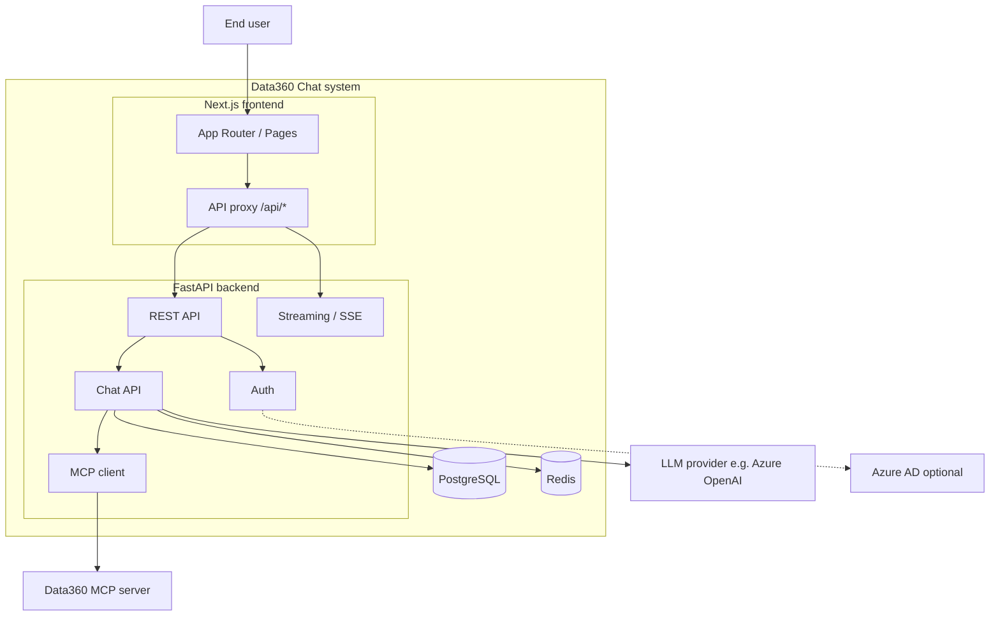

# System Context

This document describes the **system boundaries**, **actors**, and **external systems** of Data360 Chat. It sets the stage for the component-level documentation that follows.

---

## Actors

- **End user** — A person using the chatbot in a browser. They sign in (as guest, email/password, or Azure AD), open or create chats, send messages, and view streaming responses and artifacts (e.g. charts, documents).
- **System (backend)** — The FastAPI application. It authenticates requests, persists chat state, orchestrates the LLM and tools, and streams responses. It is the only component that talks to the database, Redis, the Data360 MCP server, and the LLM provider.

The user does **not** talk directly to the LLM or to the Data360 MCP server. All such traffic goes through the backend so that authentication, rate limiting, and logging are consistent.

---

## System boundary

The **Data360 Chat system** is the union of:

1. **Next.js frontend** — Serves the UI and acts as an API proxy. It receives the user's requests and forwards them to the backend; it streams responses back to the browser.
2. **FastAPI backend** — Implements the API, auth, chat logic, and AI pipeline. It is the authority for identity and chat state.
3. **PostgreSQL database** — Owned and used by the backend for all persistent state (users, chats, messages, votes, documents, files, feedback, sessions, etc.).
4. **Redis (optional)** — Used by the backend for caching and for storing stream chunks when resumable streams are enabled.

Everything outside this set is an **external system**: the user's browser, the Data360 MCP server, the LLM provider (e.g. Azure OpenAI), and optionally Azure AD for authentication.

---

## External systems

| External system | Role | Used by |
|-----------------|------|--------|
| **User's browser** | Runs the Next.js app, sends cookies and requests, consumes SSE stream. | Frontend |
| **Data360 MCP server** | Exposes MCP tools (search indicators, metadata, disaggregation, data, charts). The backend discovers tools and calls them during chat. | Backend |
| **LLM provider (e.g. Azure OpenAI)** | Provides chat and reasoning models. The backend uses LiteLLM to send prompts and receive streaming completions. | Backend |
| **Azure AD (optional)** | Issues tokens for MSAL-based login. The backend validates the token (e.g. from a cookie) to establish identity. | Backend |

There is no direct browser–to–MCP or browser–to–LLM connection. The frontend only talks to its own origin (Next.js); Next.js proxies `/api/*` to the backend.

---

## Context diagram

The following diagram summarizes the relationships: the user interacts with the Next.js app; the frontend proxies API and streaming to the FastAPI backend; the backend uses PostgreSQL and optionally Redis, and calls the Data360 MCP server and the LLM provider. Azure AD is used only when MSAL auth is configured.

---

## Data flow at a glance

- **Request path:** User action in browser → Next.js (page or API route) → proxy forwards to backend → backend validates auth, loads or creates chat, runs AI pipeline (LLM + tools), reads/writes DB and optionally Redis.
- **Response path:** Backend streams SSE → proxy forwards stream to client → frontend `useChat` and components update UI (messages, thinking, artifacts).
- **Auth:** Browser sends cookies (JWT or MSAL or session id) with every request; proxy forwards them; backend resolves user via `get_current_user` and attaches it to the request context.

The next documents describe the [Backend](backend.md) and [Frontend](frontend.md) in detail.
