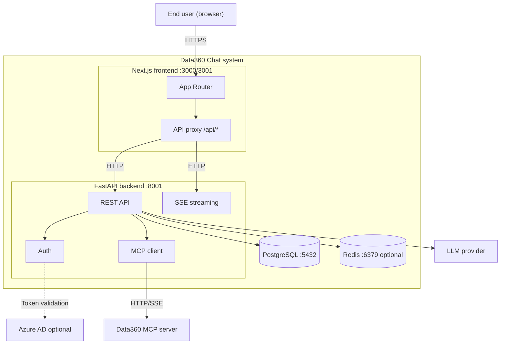

# Network Topology

This document shows how the Data360 Chat components connect and communicate.

---

## System diagram

---

## Traffic flow

1. **User → Frontend** — User accesses the app in a browser. All requests go to the frontend origin (e.g. `https://chat.example.com`).

2. **Frontend → Backend** — API and streaming requests are proxied from `/api/*` to the backend. The proxy forwards cookies, headers, and body. For streaming responses, the proxy pipes the stream without buffering.

3. **Backend → PostgreSQL** — All persistent state (users, chats, messages, etc.) is stored in PostgreSQL. The backend uses async SQLAlchemy with asyncpg.

4. **Backend → Redis** — Optional. Used for caching (e.g. resolved user) and for storing stream chunks when resumable streams are enabled.

5. **Backend → Data360 MCP** — The backend discovers MCP tools and calls them when the LLM requests data or chart operations. Communication is HTTP or SSE depending on configuration.

6. **Backend → LLM provider** — The backend sends prompts and receives streaming completions via LiteLLM (e.g. Azure OpenAI).

7. **Backend → Azure AD** — Optional. Used to validate MSAL tokens. No outbound call is required for every request if the token is a JWT validated locally.

---

## Production considerations

- **Single origin** — The frontend and backend should be served so that the user sees a single origin (e.g. frontend at `https://chat.example.com`, backend at `https://chat.example.com/api` via reverse proxy, or frontend proxying to a backend on the same host).
- **CORS** — If frontend and backend are on different origins, `CORS_ORIGINS` must list the frontend origin exactly. Wildcard `*` is not allowed with credentials.
- **Cookies** — Auth cookies use `COOKIE_DOMAIN` so they are sent to the correct host. In production, use `Secure` and `SameSite`.
